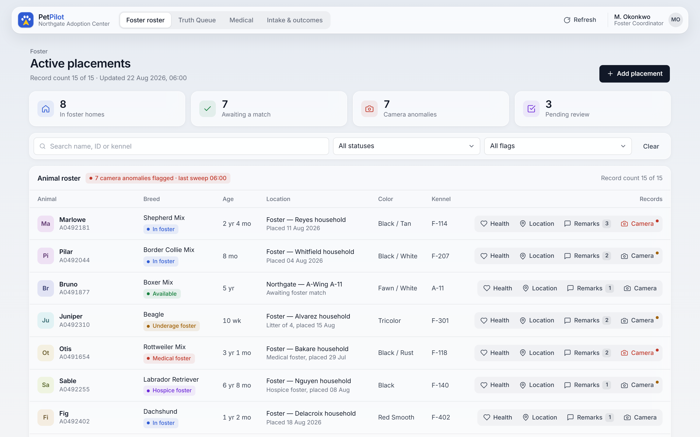
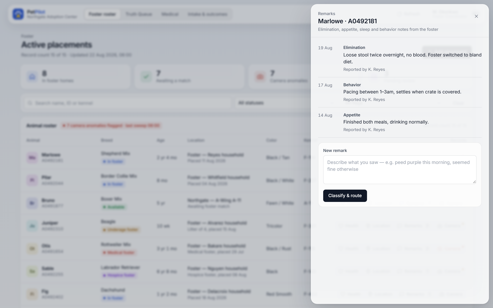
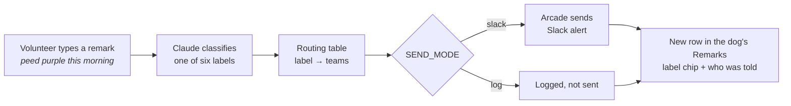
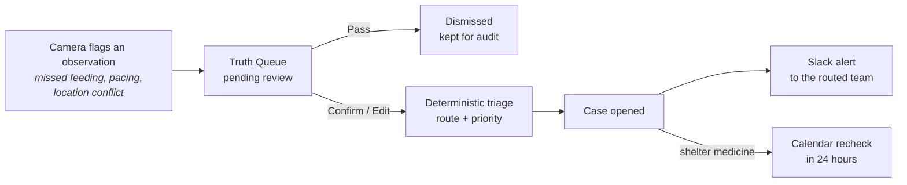
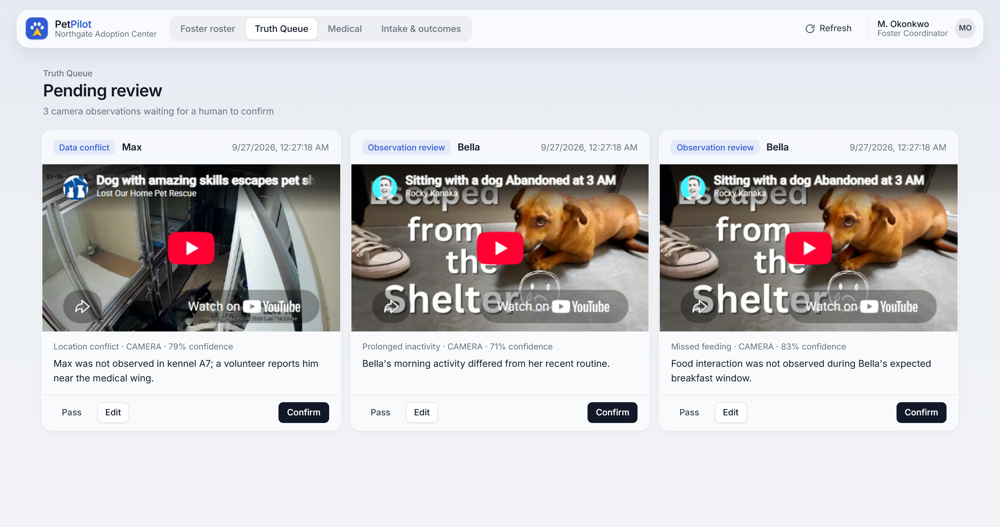
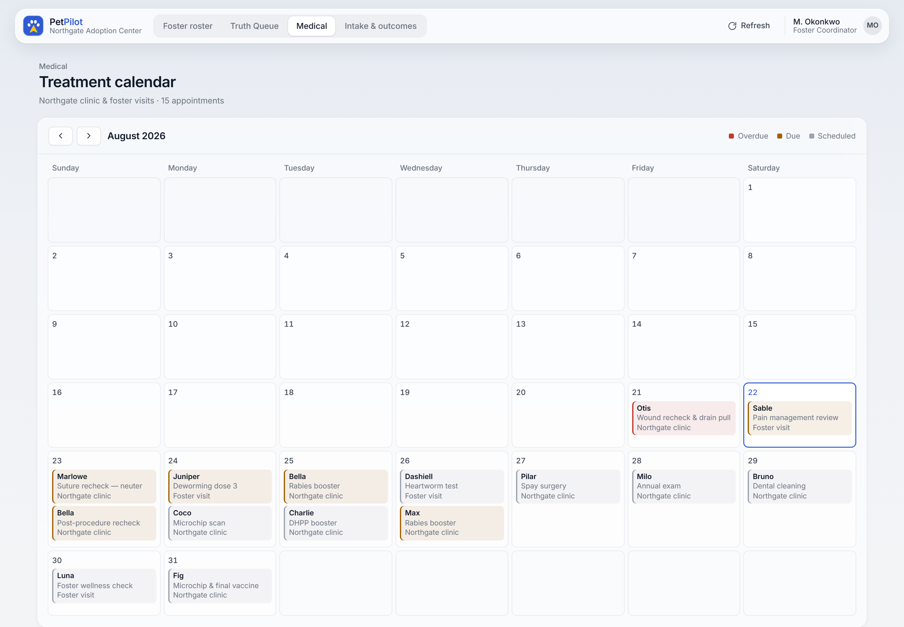
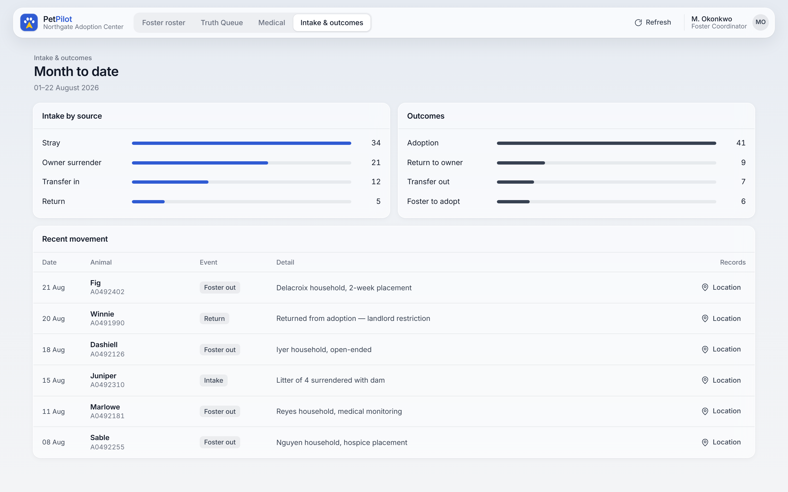
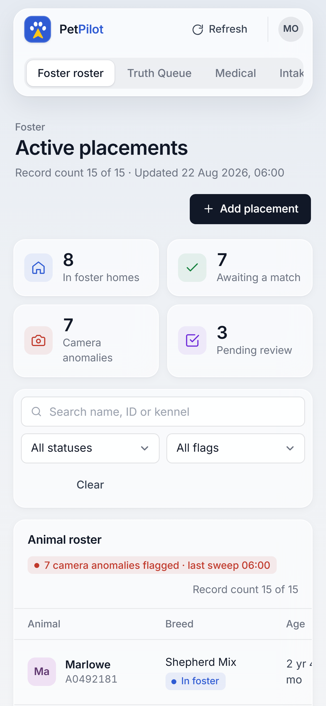

<p align="center">
  
</p>

**Shelter observations, routed to the people who need to know.**

Shelter software has a field for everything that fits in a form and nothing for what staff actually notice. A volunteer sees a dog pee purple, or notices it was lethargic on a short walk, and there is nowhere structured to put that. It ends up in a group text, or nowhere. Even when it is written down, there is no clear rule for who should hear about it: sometimes the vet team, sometimes behavior, sometimes facilities. The shelter staff we talked to said there is no one clear-cut way to decide.

PetPilot is a shelter management front end with two ways in for those observations. A **remarks router** takes what a person noticed in plain English, classifies it, routes it to the right teams, and sends the alert. A **Truth Queue** takes what a camera flagged and holds it for a human to confirm before it becomes part of the dog's record.

**Winner, AI Valley Dogathon 2026.** Built in 5 hours by a team of 4.



[Live version](https://dog-os-dogathon-1.replit.app/) · [Remarks router internals](remarks-router/README.md) · [DogOS spec](CLAUDE.md)

## What it does

| Where | What happens | Why it matters |
| --- | --- | --- |
| **Foster roster** | Every dog with placement, status, location, and one click to health, location, remarks, and camera history | One place to see who is where and what is open |
| **Remarks** | Type an observation, hit **Classify & route**. Claude labels it, a routing table picks the teams, Arcade sends the Slack alert | The weird stuff finally lands with someone who can act on it |
| **Truth Queue** | Camera observations wait for a person to **Confirm**, **Edit**, or **Pass** | A camera guess never becomes a medical fact on its own |
| **Medical** | Month calendar of treatments, with overdue and due items marked | Rechecks and boosters stop slipping |
| **Intake & outcomes** | Month-to-date intake by source, outcomes, and recent movement | The numbers a coordinator gets asked for |



## How it works

### Remarks: free text in, the right teams alerted



Routing is a lookup table, not a model decision. That keeps it inspectable: you can read exactly why an alert went where it went, which matters more than sophistication when a vet is the one being paged.

| Label | Routed to |
| --- | --- |
| `medical_urgent` | `#shelter-medical`, `#shelter-managers` |
| `medical_routine` | `#shelter-medical` |
| `behavior` | `#behavior-team` |
| `facility` | `#operations` |
| `enrichment` | `#enrichment` |
| `unclear` | `#shelter-managers` (when in doubt, a human triages) |

Arcade handles the authenticated send, so the project ships no OAuth flow of its own and per-user tokens stay out of this codebase. A shelter alert router has to reach people across a volunteer base that turns over constantly, so delegated auth is the right primitive rather than an afterthought.

### Truth Queue: a human confirms before anything becomes fact



Triage is a small set of rules, not a model. It never produces a diagnosis, only a route (shelter medicine, behavior, operations, volunteer review) and a priority. A medical lean only applies when the dog has recent medical history, such as a feeding change right after a procedure.



## A closer look

| Medical calendar | Intake & outcomes |
| --- | --- |
|  |  |

<p align="center">
  
</p>

## Running locally

You need **Node.js** and **Python**. For the Truth Queue you also need **Docker** (for MongoDB). Each service runs in its own terminal.

### 1. Front end

From the repo root:

```bash
python -m http.server 8000
```

Open <http://localhost:8000/Foster%20Board.dc.html>. The page must be **served**, not opened as a file; double-clicking the HTML leaves every `{{ value }}` unresolved because the runtime cannot boot.

### 2. Remarks router (port 3001)

```bash
cd remarks-router
cp .env.example .env              # Windows: copy .env.example .env
npm install
node --env-file=.env server.js    # prints "remarks router listening on :3001"
```

`npm start` does not read `.env`, so start it with `--env-file` as above.

| Variable | Needed for |
| --- | --- |
| `ANTHROPIC_API_KEY` | Required. Without it, classification fails. Get one at console.anthropic.com |
| `ARCADE_API_KEY` / `ARCADE_USER_ID` | Only for real Slack sending |
| `SEND_MODE` | `log` classifies and logs the alert without sending. `slack` sends for real, once Arcade is set up and you have joined the channels |

### 3. DogOS backend for the Truth Queue (port 4000)

```bash
cd backend
cp .env.example .env
docker compose up -d     # MongoDB on :27017
npm install
npm run seed             # 7 dogs, medical records, 3 pending observations
npm start                # prints "DogOS backend listening on :4000"
```

Without Arcade keys the backend runs in stub mode and logs the Slack and Calendar actions it would take. To point the page at a deployed backend, open it with `?api=https://your-backend/api`; the choice is remembered in the browser.

`.env` files are git-ignored. Never commit them.

> **Windows:** if `npm` fails with "running scripts is disabled," use Command Prompt instead of PowerShell, or run once:
> `Set-ExecutionPolicy -Scope CurrentUser -ExecutionPolicy RemoteSigned`

### Try it

Open a dog's **Remarks**, type an observation, hit **Classify & route**. A new row appears with a label chip and the teams it routed to. If you see "Couldn't reach the router," the remarks router is not running or errored; a missing `ANTHROPIC_API_KEY` shows up in its terminal as an authentication error.

Then open **Truth Queue** and confirm one of the seeded observations to see the case it opens.

## Where things live

| Path | What |
| --- | --- |
| `Foster Board.dc.html` | The whole front end: roster, Truth Queue, medical calendar, intake and outcomes, and the record drawer. Single-file Design Component app, React via CDN |
| `support.js` | The Design Component runtime the page loads |
| `_ds/` | Design system bundle the page loads |
| `remarks-router/` | Classify, route, and send (Node/Express). See its [README](remarks-router/README.md) for endpoints and internals |
| `backend/` | DogOS backend (Node/Express + MongoDB): dogs, observations, review queue, cases, care events, Arcade actions |
| `CLAUDE.md` | The DogOS product and build spec |
| `docs/assets/` | Banner and screenshots for this README |
| `.replit` | Replit run config for the deployed backend |

The front end calls the remarks router at `http://localhost:3001` (`REMARKS_API`) and the DogOS backend at `http://localhost:4000/api` (`API_BASE`), both set near the bottom of `Foster Board.dc.html`.

## Honest limits

Built in one 5-hour session, so:

- All shelter data is synthetic. There is no real PetPoint integration; PetPilot is designed as a layer that sits alongside a shelter's system of record, not a replacement for it.
- Remarks routing is a fixed table, not learned from a shelter's own history of who got alerted for what. That is the obvious next step, and the reason to want real data.
- Six labels is a starting taxonomy, not a validated one.
- Truth Queue triage is hand-written rules over six observation types. The camera observations are seeded; there is no live vision pipeline in this repo.
- The remarks router and the DogOS backend are separate services that do not share data yet. A typed remark does not enter the Truth Queue.

## What this would unlock

The router has to touch every system a shelter already runs, which makes it a reasonable wedge for the things the shelter staff asked for and we could not build in five hours: syncing to electronic health records so an adopted animal arriving at a hospital does not need manual re-entry, keeping Salesforce and the shelter system consistent instead of diverging, inter-shelter transfer requests with tracking, and quarantine history that is currently hard to retrieve at all.

## Team

- Pranav Balachander, [pruhnav](https://github.com/pruhnav)
- Kiran Oguri, [kiran172](https://github.com/kiran172)
- Arshia Bhattacharyya, [arshiabyya](https://github.com/arshiabyya)
- Trisha Moorkoth, [tprofessional](https://github.com/tprofessional)
